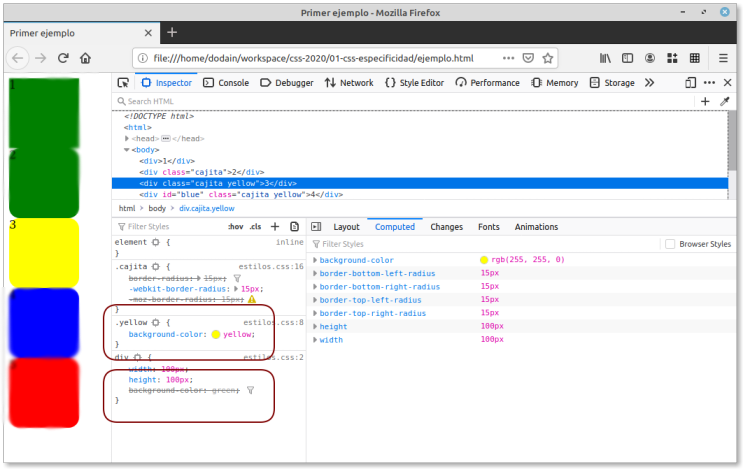
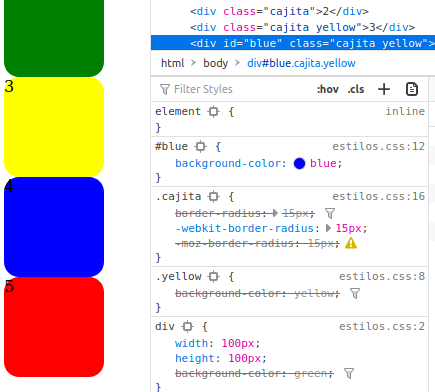
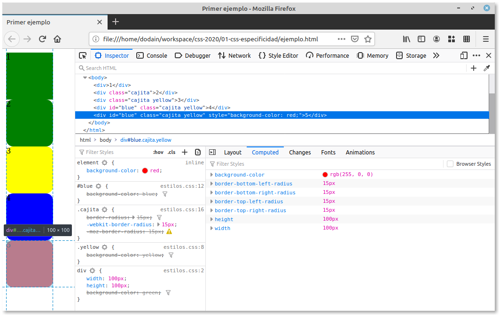
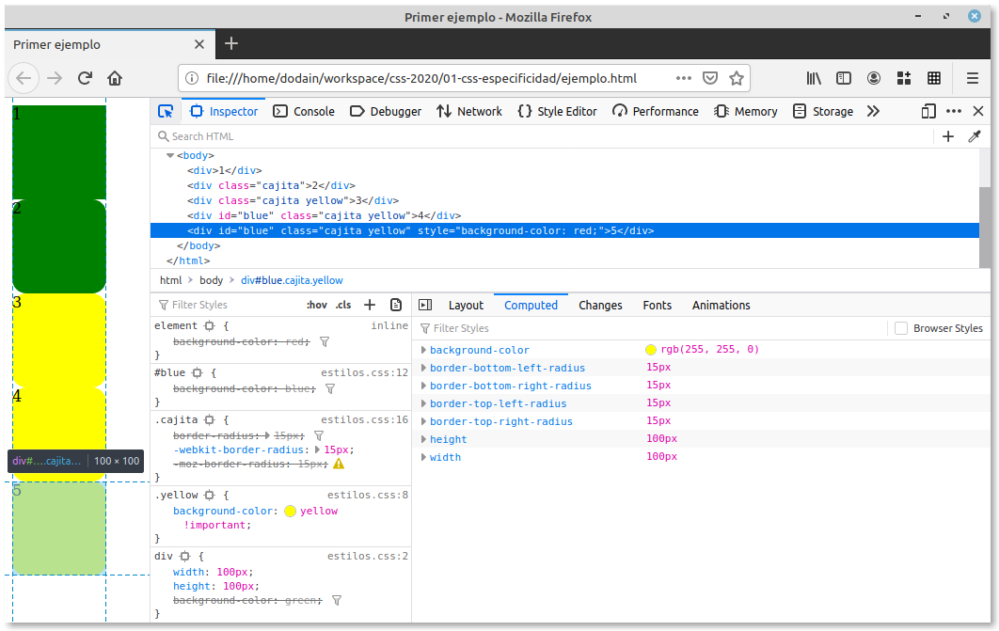
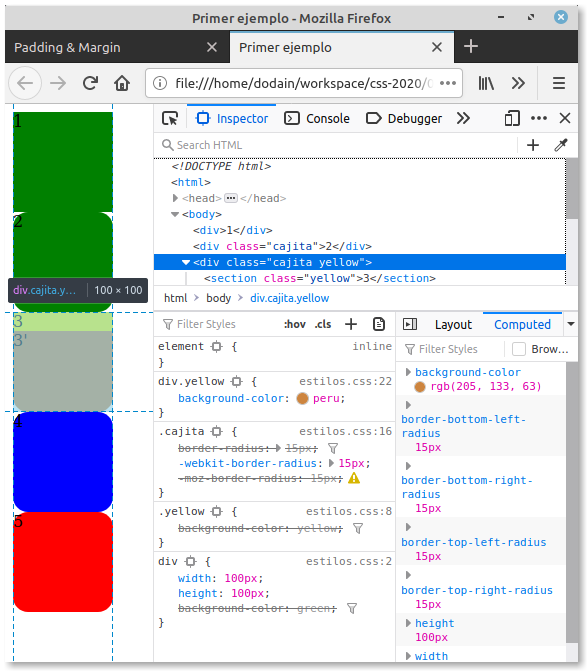
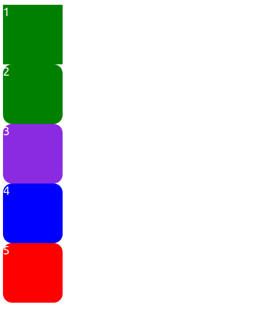

## Ejemplo vivo

https://codepen.io/fdodino/pen/LYGOaJV

## Cascada de estilos

Los archivos css permiten definir reglas [en cascada](https://developer.mozilla.org/es/docs/Learn/CSS/Building_blocks/Cascada_y_herencia) que se aplican y combinan sobre los elementos de un documento HTML. Ahora bien, para entender de qué manera una regla puede pisar la definición de otra, tenemos que conocer el concepto **especificidad**.

## Especificidad

La [especificidad](https://developer.mozilla.org/es/docs/Web/CSS/Especificidad) en CSS indica de qué manera cada elemento adopta el estilo que le corresponde según las siguientes prioridades, partiendo de la más baja hasta la más alta:

- selectores por elemento o _tag HTML_: `h1`, `div`, `p`, etc.
- selectores por clase/atributo, lo que en html se define con el atributo `class`
- selectores por identificador (atención que en una página HTML bien formada solo puede haber un identificador por elemento)
- estilos inline


Pueden ver el artículo de [Andy Clarke](https://stuffandnonsense.co.uk/archives/css_specificity_wars.html1), que propone una metáfora basada en Star Wars para explicar las prioridades de cada especificidad.

## Nuestro ejemplo

### Div solo

En el primer caso tenemos:

```html
<div>1</div>
```

Nuestro archivo de estilos es

```css
div {
  width: 100px;
  height: 100px;
  background-color: green;
}
```

La especificidad de esta definición es `0,0,0,1`:

| inline | identificador | clase | tag |
| ------ | ------ | ----- | ------ |
|0|0|0|1|
| | | | div |

Por eso vemos un rectángulo de color verde.

### Div cajita

Veamos ahora el siguiente ejemplo:

```
<div class="cajita">2</div>
```

Aquí tenemos una especificidad `0,0,1,1`:

| inline | identificador | clase | tag |
| ------ | ------ | ----- | ------ |
|0|0|1|1|
| | | .cajita | div |

```css
.cajita {
  border-radius: 15px;
  -webkit-border-radius: 15px;
  -moz-border-radius: 15px;
}
```

Esto produce únicamente una caja verde con borde redondeado, pero si le agregamos un color de fondo diferente, va a pisar la definición del estilo para el elemento `div`:

```css
.cajita {
  border-radius: 15px;
  -webkit-border-radius: 15px;
  -moz-border-radius: 15px;
  background-color: paleturquoise;
}
```

A continuación te mostramos cómo abrir en Firefox el modo Desarrollo con F12, y luego presionando el botón sobre la cajita podés ver qué propiedades tenés activadas y cuáles se inactivan porque tienen menos prioridad (incluso podés modificar esa prioridad para ver los cambios en el navegador):


Volvemos para atrás el cambio ya que los siguientes ejemplos necesitan que tengamos nuestro valor por defecto en verde.

> En general te recomendamos que hagas las pruebas en el navegador Firefox, porque tiene mejores herramientas que Google Chrome.

### Tercera cajita: class

En esta definición

```html
<div class="cajita yellow">3</div>
```

aparecen dos clases, tenemos entonces especificidad general `0,0,2,1`, y aquí la clase `yellow` pisa la definición de `div`

| inline | identificador | clase | tag |
| ------ | ------ | ----- | ------ |
|0|0|1|1|
| | | .yellow -> "amarillo" | div -> "verde" |


por eso vemos el rectángulo en amarillo.



### Cuarta cajita: id

```html
<div id="blue" class="cajita yellow">4</div>
```

La especificidad general es `0,1,2,1`, en particular para definir el color de fondo podemos ver que

| inline | identificador | clase | tag |
| ------ | ------ | ----- | ------ |
|0|1|1|1|
| | id="blue" -> azul | .yellow -> "amarillo" | div -> "verde" |



> **Nota**: dado que un html válido solo debe contener un único `id`, no recomendamos generar estilos que dependan de un identificador a menos que explícitamente debamos definir un estilo particular en un lugar muy específico.

### Quinta cajita: inline style

```html
<div style="background-color: red;" id="blue" class="cajita yellow">5</div>
```

Aquí tenemos una especificidad general `1,1,2,1`, para el color de fondo aplican estas definiciones

| inline | identificador | clase | tag |
| ------ | ------ | ----- | ------ |
|1|1|1|1|
| inline -> rojo | id="blue" -> azul | .yellow -> "amarillo" | div -> "verde" |

Podemos ver cómo se van pisando los estilos en el navegador:



De la misma manera que desaconsejamos el uso de `id` para generar estilos, el estilo inline [tiene muchas desventajas](https://stackoverflow.com/questions/2612483/whats-so-bad-about-in-line-css):

- los cambios se van propagando por medio de copy/paste, por lo que cada modificación requiere editar manualmente uno por uno cada estilo
- al no centralizar el look & feel, es muy difícil generar un "dark mode" (modo claro/oscuro)
- los navegadores descargan los archivos de estilos una vez y lo guardan en una cache, por lo que si la siguiente página html usa la misma hoja de estilos el archivo ya estará descargado (mejora en performance)

### VIP: Very !important anti-Pattern

Otra "herejía" consiste en utilizar la declaración `!important` que echa por tierra las prioridades establecidas por la especificidad. Hagamos ahora este cambio en nuestro css:

```css
.yellow {
  background-color: yellow !important;
}
```

¿Qué sucede con las cajitas?



Las últimas tres se colorean con amarillo, porque el important deja como prioritaria la definición de la clase "yellow". Esto puede iniciar una guerra de importants, donde alguien decide colocar el `!important` para el id blue:

```css
#blue {
  background-color: blue !important;
}
```

y ahora tenemos las últimas dos cajas pintadas de azul, porque cuando se cruzan dos `!important` prevalece el criterio de especificidad, y recordemos que `id` > `class`. En definitiva, cuando agregamos un `!important` rompemos el orden natural de especificidad y esto es muy probable que nos lleve a agregar nuevos `!important`, algo como


> Por este motivo desaconsejamos fuertemente el uso de la cláusula `!important` como técnica para forzar el cambio de prioridades en la definición de estilos.

### BONUS 1: Combinación de especificidades

Un caso adicional puede ser que el css combine un tag + una clase, por ejemplo:

```css
/* definición previa */
.yellow {
  background-color: yellow;
}

div.yellow {
  background-color: peru;
}
```

Modifiquemos la cajita tres de la siguiente manera:

```html
<div class="cajita yellow">
  <section class="yellow">3</section>
  3'
</div>
```

Ahora veremos que

- el div que tiene yellow aparece con un color naranja por la definición específica `div.yellow`
- mientras que el section con class yellow toma el color amarillo de la definición `.yellow` en css



### BONUS 2: Múltiples clases

También podemos definir en nuestro css precedencia si varias clases se combinan en un elemento:

```css
.cajita.yellow {
  background-color: blueviolet;
}
```

volviendo nuestra tercera cajita a:

```html
<div class="cajita yellow">3</div>
```

Ahora veremos en violeta la tercera cajita, ya que ambas clases `cajita` y `yellow` tienen prioridad sobre la `yellow`:

| inline | identificador | clase | tag |
| ------ | ------ | ----- | ------ |
|0|0|2|1|
| | | .cajita .yellow -> "violeta" > .yellow -> "amarillo" | div -> "verde" |

### Herencia de estilos

Para algunas propiedades es posible definir reglas que se heredan de un elemento padre a otro hijo: colores, font, son alguno de ellos. Si agregamos estas propiedades para el selector `div`:

```css
div {
  font-family: Ubuntu;
  font-size: 20px;
  color: white;
```

Esto se hereda a los elementos hijos del div en el html, incluso si modificamos nuestra primera cajita a:

```html
  <div>
    <span>1</span>
  </div>
```

Veremos que todas las cajas ahora se visualizan con un font Ubuntu color blanco de tamaño 20 píxeles:



## Material adicional

- [CSS Specificity: Things you should know](https://www.smashingmagazine.com/2007/07/css-specificity-things-you-should-know/)
- [Specifics on CSS Specificity](https://css-tricks.com/specifics-on-css-specificity/)
- [A Specificity Battle](https://css-tricks.com/a-specificity-battle/)
- [CSS Specificity - When several rules collide](https://marksheet.io/css-priority.html)
- [Specificity Calculator](https://specificity.keegan.st/)
- [Grafo de especificidad](https://jonassebastianohlsson.com/specificity-graph/), podés copiar y pegar tu archivo css y te muestra gráficamente la definición de especificidades

